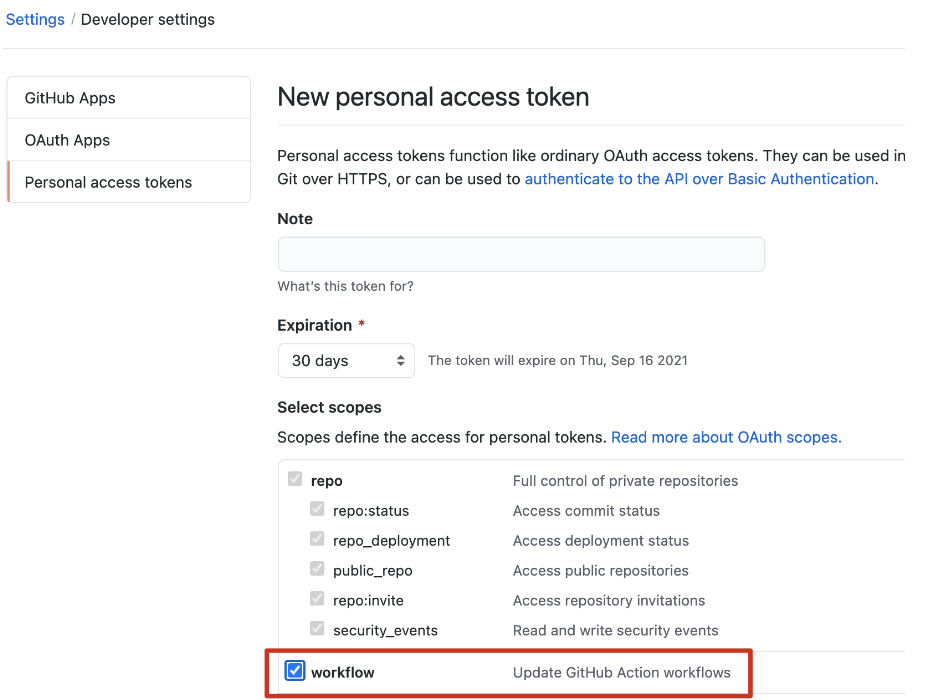
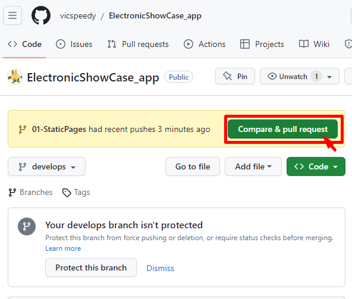
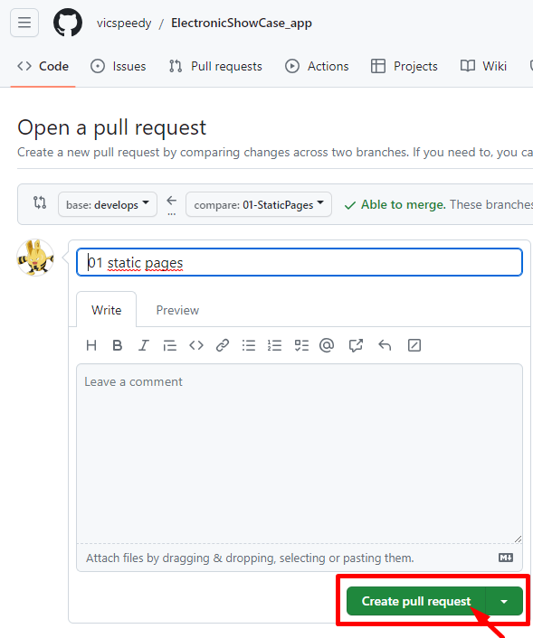
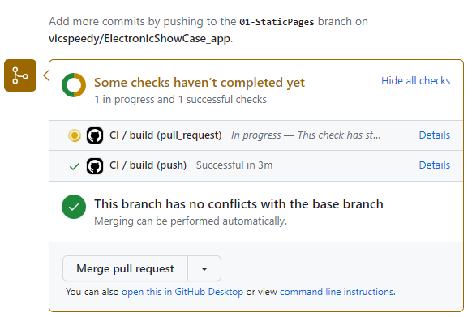
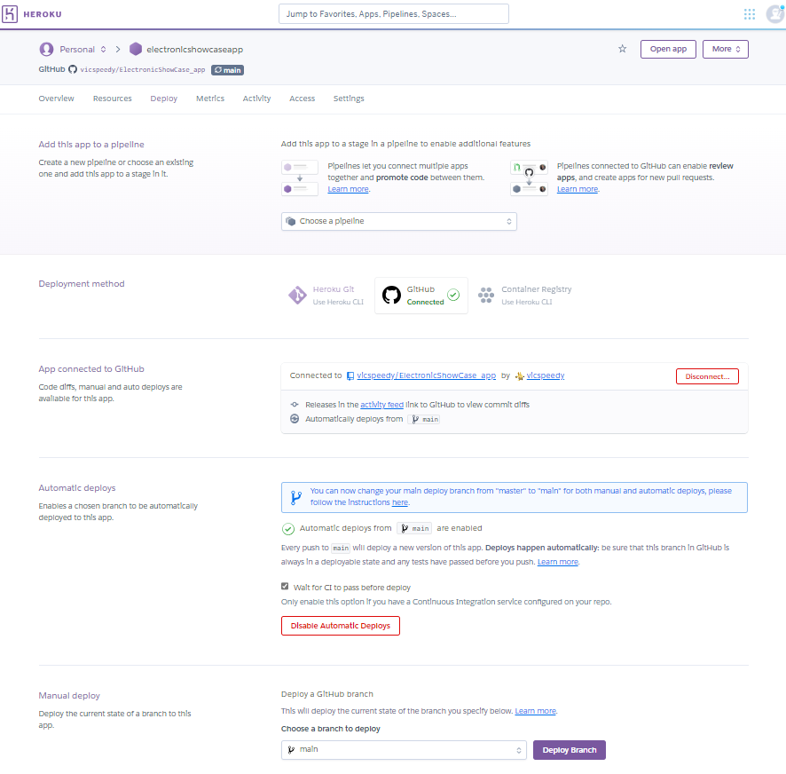
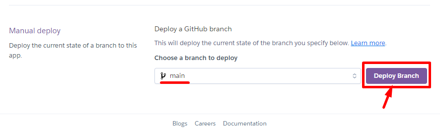
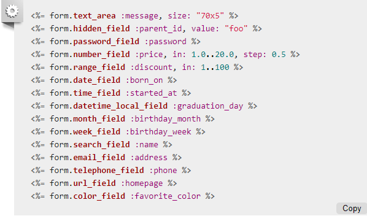

# README

This README would normally document whatever steps are necessary to get the
application up and running.

Things you may want to cover:

* Ruby version

* System dependencies

* Configuration

* Database creation

* Database initialization

* How to run the test suite

* Services (job queues, cache servers, search engines, etc.)

* Deployment instructions

* ...

# ElectronicShowCase
* rails new ElectronicShowCase_app -d postgresql && cd ElectronicShowCase_app
* git add .
* git commit -m "Primer commit"
* git remote add origin https://github.com/vicspeedy/ElectronicShowCase_app.git
* git branch -M main
* git push -u origin main
## Generar Rama Develops
* git checkout -b develops # Cambia a la rama
* git push -u origin develops
* Configurar el repositorio de github en setting - default branch - develops - update - I understand, update the default branch

### Cada Caracteristica debe subir en una rama separada
* git checkout -b 01-StaticPages
*
* rails g controller Pages home terms privacy 
### Run App
* rails s -b 0.0.0.0
### No se creo la BD desde la misma pagian "http://localhost:3000/" boton create database
### Crear BD
* rails db:create
### Cambiar ruta raiz config/routes.rb
* root "pages#home"
### Git
* add .
* git commit -m "Feat(Page Controllers) Views create home terms privacy" # Crear el primer "features"

### Renombrar Rutas config/routes.rb "http://localhost:3000/privacy"
* get '/home',    to: 'pages#home'
* get '/terms',   to: 'pages#terms'
* get '/privacy', to: 'pages#privacy'

### Run App
* rails s -b 0.0.0.0

### Agregar Nav a app/views/layouts/applications.html.erb
<!-- NAV LINK -->
    <nav>
      <ul>
        <li><%= link_to "Home", root_path %></li>
        <li><%= link_to "Terms", terms_path %></li>
        <li><%= link_to "Privacy", privacy_path %></li>
      </ul>
    </nav>

### Git
* git add .
* git commit -m "Feat(Page Routes) Rutas Amigables"

### Add Contact (Especificar lo que se necesita y lo que no)
* rails g scaffold Contact name email message:text
* rails db:migrate db:migrate:status

### Git
* git add .
* git commit -m "Feat(Contact scaffold) Inicial"

### Add Contact (Especificar lo que se necesita y lo que no)
### Quitar: before_action, index, show, edit, update, destroy
### Dejar: new, create, set_contact, contact_params
def create
 ...
 if @contact.save
  format.html { redirect_to new_contact_path, notice: "Contact was successfully created." }
  ...

### Cambiar ruta contacts config/routes.rb solo new y create
* resources :contacts, only: [:new, :create]
### Eliminar las Views app/views/contacts
### Dejar: _form.html.erb, new.html.erb

### Git
* git add .
* git commit -m "Feat(Contact Views) Vistas necesarias form new"

### Agregar Nav Contacts a app/views/layouts/applications.html.erb
 <li><%= link_to "Contacts", new_contact_path %></li> 

### Validaciones de Contacts
#### Modelo app/models/contact.rb
    validates :name,    presence: true
    validates :email,   presence: true, 
                        format: {with: URI::MailTo::EMAIL_REGEXP} # formato correo
    validates :message, presence: true
#### Vista app/views/contacts/_form.html.erb
 <%= form.text_field :name, 
    autofocus: true, 
    required: true,
    placeholder: "Nombre Apellido" %>
 <%= form.text_field :email, 
    required: true, 
    pattern: "^[a-zA-Z0-9.!#$%&’*+/=?^_`{|}~-]+@[a-zA-Z0-9-]+(?:\.[a-zA-Z0-9-]+)*$",
    style: "text-transform:lowercase",
    onkeyup: "javascript:this.value=this.value.toLowerCase();",
    placeholder: "tucorreo@mail.com" %> %>
 <%= form.text_area :message, 
    required: true, 
    minlength: 10, 
    maxlength: 200,
    placeholder: "Escribe tu texto" %>

### Modificar app/views/contacts/new.html.erb
<%= link_to "Back Home", root_path %>

### Git
* git add .
* git commit -m "Feat(Contact Validates) Validar Model Views"

### Agregar la carpeta .github 
### Git
* git add .
* git commit -m "Doc:(Github Files) Integracion, Tareas pull request"
* git push -u origin 01-StaticPages
### Configuracion prioridad al flujo de trabajo cuando se crea el token

### Realizar en Github Pull Request (Comparar codigo)

### Crear Pull Request

### Se Integra "CI" gracias a .github/workflows/main.yml

### Moverse a la rama develops
* git checkout develops

### Fucionar lo que esta en "develops" from "01-StaticPages"

### Ver los commit por rama cambios 

### Estando en la nube (Github) descargarlo
### Git rama local develops no hay nada
* git status
* git pull origin develops

## Heroku
### Ir https://dashboard.heroku.com/apps
* New - Create new app 
* app name: electronicshowcaseapp "minuscula numeros guiones"
* Create app
### Conectarse a GitHub y buscar repositorio

* Choose a branch to deploy: main (Elegir la rama)
* Wait for CI to pass before deploy (habilitar CI)
* Enable Automatic Deploys

### En la Rama Main no hay nada en Github realizar un nuevo pull request

### A Main darle lo que esta en develops

### Open pull request desde el archivo .github/pull_request_template.md
#### Configuraciones Pull Request atractivo para implementar (Theme) colocar nombre: 01-Static Pages
* Enter - Create pull request
### Se tiene que actualizar el CI

* Merge pull request
* Confirm merge
### Compare & pull request ir Code
* Compare & pull request
* Create pull request

### Se Actualiza Main con lo de develops

# Heroku
## Deploy de la App Automatico (CI)
## Deploy de la App Manual
* Deploy Branch

### Crear nueva rama 
* git checkout -b 02-ReferenceModels

### Modelo Categoria (uno a N)
* rails g model Category name:string available:boolean
### Migracion Categoria Agregar default true
* t.boolean :available, default: true
### Migracion
* rails db:migrate db:migrate:status

### Git
* git add .
* git commit -m "Feat(Category Model) Modelo creado"

### Modelo Caracteristicas (N a N)
* rails g model Feature name:string available:boolean
### Migracion Caracteristicas Agregar default true
* t.boolean :available, default: true
### Migracion
* rails db:migrate db:migrate:status

### Git
* git add .
* git commit -m "Feat(Feature Model) Modelo creado"

### Validaciones app/models/category.rb
    validates :name,      presence: true,
                          uniqueness: true
    validates :available, inclusion: { in: [true, false] }

### Validaciones app/models/feature.rb
    validates :name,      presence: true,
                          uniqueness: true
    validates :available, inclusion: { in: [true, false] }

### Git
* git add .
* git commit -m "Feat(Category, Feature Model) Validaciones Backend"

## Agregar Archivo Procfile
release: bundle exec rails db:migrate
web: bundle exec puma -C config/puma.rb

### Git
* git add .
* git commit -m "Doc:(Procfile) Archivo de Heroku"

### Agregar Carpeta db/seeds/csv
### Agregar el archivo categories.csv
 category_id,name,available
 1,Categoria 1,true
 2,Categoria 2,false
 3,Categoria 3,true
 4,Categoria 4,false
 5,Categoria 5,true
 6,Categoria 6,false
### Agregar el archivo features.csv
 feature_id,name,available
 1,Caracteristicas 1,true
 2,Caracteristicas 2,false
 3,Caracteristicas 3,true
 4,Caracteristicas 4,false
 5,Caracteristicas 5,true
 6,Caracteristicas 6,false

### Configurar el db/seed.rb
require 'csv'

puts 'Importing categories...'
CSV.foreach(Rails.root.join('db/seeds/csv/categories.csv'), headers: true) do |row|
  Category.create! do |category|
    category.id = row[0]
    category.name = row[1]
    category.available = row[2]
  end
end

require 'csv'

puts 'Importing features...'
CSV.foreach(Rails.root.join('db/seeds/csv/features.csv'), headers: true) do |row|
  Feature.create! do |feature|
    feature.id = row[0]
    feature.name = row[1]
    feature.available = row[2]
  end
end

### Migrar
* rails db:seed
### Verificar en Console
* rails c
* Category.all
* exit

### Git
* git add .
* git commit -m "Doc:(CSV Files) Archivos csv creados y asociados al seeds"
* git push origin 02-ReferenceModels

### GitHub
* Compare & pull request
* Create pull request
* Merge pull request
* Confirm merge
### New pull request para la rama Main
* New pull request
* base:main <- compare:develops
* Create pull request
* Colocar titulo 02-ReferenceModels - enter
* Esperar el CI

### Moverse a la rama develops
* git checkout develops
* git status
* git pull origin develops

### Crear nueva rama 
* git checkout -b 03-AutenticateSystem

## Devise
### Instalar devise
* bundle add devise
### Agregar a Gemfile
gem 'devise'
### Instalar de Gemfile
* bundle install
### Instalar Devise
* rails g devise:install
### Agregar en config/environments/development.rb
* config.action_mailer.default_url_options = { host: 'localhost', port: 3000 }
### Agregar flash messages app/views/layouts/application.html.erb
    
<%= notice %>

    
<%= alert %>

### Git
* git add .
* git commit -m "Feat(Devise) Instalacion y configuracion devise"

## Git 
### Descomentar production en config/database.yml
* git add .
* git commit -m "Feat(DataBase) Descomentado production"

### Agregar User con los campos nombre bio rol
* rails g devise User name bio:text role:string 
### Migrar 
* rails db:migrate db:migrate:status

### Descomentar config/initializers/devise.rb
* config.navigational_formats = ['*/*', :html, :turbo_stream]

### Git
* git add .
* git commit -m "Feat(User model) Modelo generado con devise"

### Agregar Archivo app/controllers/registrations_controller.rb
 class RegistrationsController < Devise::RegistrationsController
  before_action :configure_permitted_parameters, if: :devise_controller?
  protect_from_forgery with: :exception

  protected

  def configure_permitted_parameters
    added_attrs = %i[ email password password_confirmation remember_me
                      name bio ]

    devise_parameter_sanitizer.permit :sign_up, keys: %i[email password password_confirmation]
    devise_parameter_sanitizer.permit :sign_in, keys: %i[email password remember_me]
    devise_parameter_sanitizer.permit :account_update, keys: added_attrs
  end

  def update_resource(resource, params)
    resource.update_without_password(params)
  end
 end

### Routes con Devise
 devise_for :users,  controllers: { registrations: 'registrations' },
                      path: '',
                      path_names: { sign_in: 'login',
                                    sign_out: 'logout',
                                    sign_up: 'registrate' }

### Git
* git add .
* git commit -m "Feat(User) Configuracion inicial ruta y vista"

### Generar Vistas Devise "solo" para User
* rails g devise:views users

### Descomentar config/initializers/devise.rb
* config.scoped_views = true

### Agregar app/views/users/registration/edit.html.erb
 

    <%= f.label :name %>  
    <%= f.text_field :name, autocomplete: "new-name" %>
  

  
  

    <%= f.label :bio %>  
    <%= f.text_area :bio %>
  

### Comentar app/views/users/registration/edit.html.erb
  

    <%#= f.label :current_password %> <i>(we need your current password to confirm your changes)</i> 
    <%#= f.password_field :current_password, autocomplete: "current-password" %>
  

### Configurar app/models/user.rb Mostrar nombre o correo
 def full_name
    name.blank? ? email : name
 end

### Llamar el metodo en la vista app/views/layouts/application.html.erb
    <li>
        <strong><%= current_user.full_name %></strong> 
    </li>

### Agregar Rol app/views/layouts/application.html.erb
 <strong><%= current_user.full_name %></strong> | <%= current_user.role %>

## Input Data
https://guides.rubyonrails.org/form_helpers.html

### Git
* git add .
* git commit -m "Feat(User Views) Modelo y Vistas modificadas"

### Agregar app/models/user.rb Roles
  validates :role, inclusion: { in: %w[normal administrador] }
  enum role: {
    normal: 'normal',
    admin: 'administrador'
  }, _default: 'normal'

### Agregar annotate al Gemfile
 group :development, :test do
   gem 'annotate'
 end
### Ejecutar annotate
* annotate --models 

### Git
* git add .
* git commit -m "Doc:(Annotate Gem) Anotaciones en el modelo"

### Git
* git add .
* git commit -m "Feat(User Model) Agregados los Roles"
* git push -u origin 03-AutenticateSystem

## GitHub
* Compare & pull request
* Create pull request
* Merge pull request
* Confirm merge
### New pull request para la rama Main
* New pull request
* base:main <- compare:develops
* Create pull request
* Colocar titulo 03-AutenticateSystem - enter
* Esperar el CI
* Merge pull rquest
* Confirm merge

### Moverse a la rama develops
* git checkout develops
* git status
* git pull origin develops

### Crear nueva rama 
* git checkout -b 04-ProductScaffold

### Agregar Producto
* rails g scaffold Product user:references name description:text category:references price:integer release_date:date link_to_website:string available:boolean
### Migracion producto Agregar default true
* t.boolean :available, default: true
### Migracion
* rails db:migrate db:migrate:status