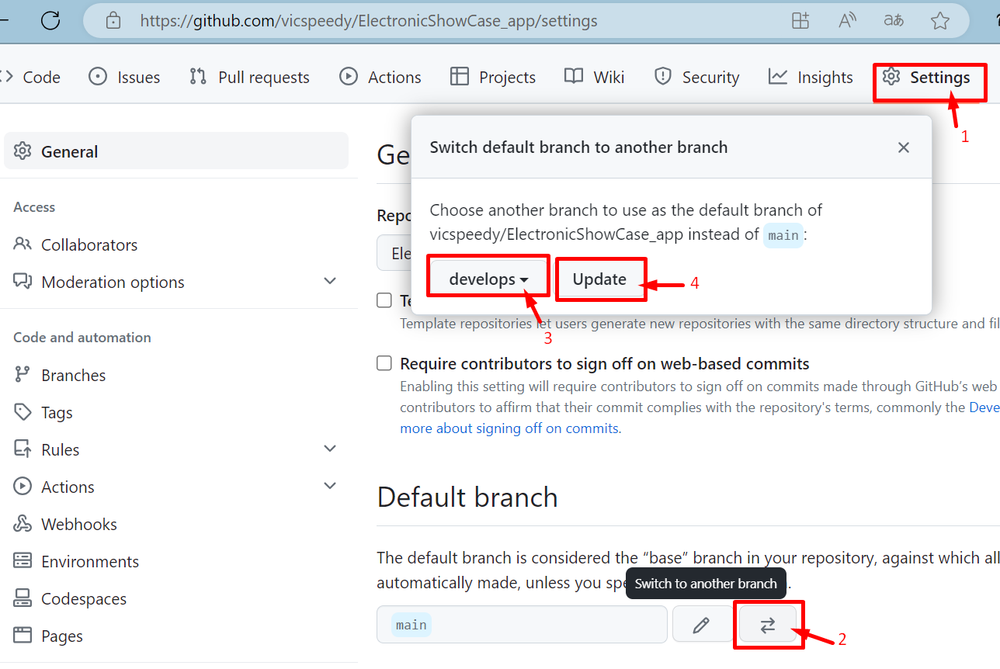

# README

This README would normally document whatever steps are necessary to get the
application up and running.

Things you may want to cover:

* Ruby version

* System dependencies

* Configuration

* Database creation

* Database initialization

* How to run the test suite

* Services (job queues, cache servers, search engines, etc.)

* Deployment instructions

* ...

# ElectronicShowCase
* rails new ElectronicShowCase_app -d postgresql && cd ElectronicShowCase_app
* git add .
* git commit -m "Primer commit"
* git remote add origin https://github.com/vicspeedy/ElectronicShowCase_app.git
* git branch -M main
* git push -u origin main
## Generar Rama Develops
* git checkout -b develops # Cambia a la rama
* git push -u origin develops
* Configurar el repositorio de github en setting - default branch - develops - update - I understand, update the default branch

### Cada Caracteristica debe subir en una rama separada
* git checkout -b 01-StaticPages
*
* rails g controller Pages home terms privacy 
### Run App
* rails s -b 0.0.0.0
### No se creo la BD desde la misma pagian "http://localhost:3000/" boton create database
### Crear BD
* rails db:create
### Cambiar ruta raiz config/routes.rb
* root "pages#home"
### Git
* add .
* git commit -m "Feat(Page Controllers) Views create home terms privacy" # Crear el primer "features"

### Renombrar Rutas config/routes.rb "http://localhost:3000/privacy"
* get '/home',    to: 'pages#home'
* get '/terms',   to: 'pages#terms'
* get '/privacy', to: 'pages#privacy'

### Run App
* rails s -b 0.0.0.0

### Agregar Nav a app/views/layouts/applications.html.erb
<!-- NAV LINK -->
    <nav>
      <ul>
        <li><%= link_to "Home", root_path %></li>
        <li><%= link_to "Terms", terms_path %></li>
        <li><%= link_to "Privacy", privacy_path %></li>
      </ul>
    </nav>

### Git
* add .
* git commit -m "Feat(Page Routes) Rutas Amigables"

### Add Contact (Especificar lo que se necesita y lo que no)
* rails g scaffold Contact name email message:text
* rails db:migrate db:migrate:status